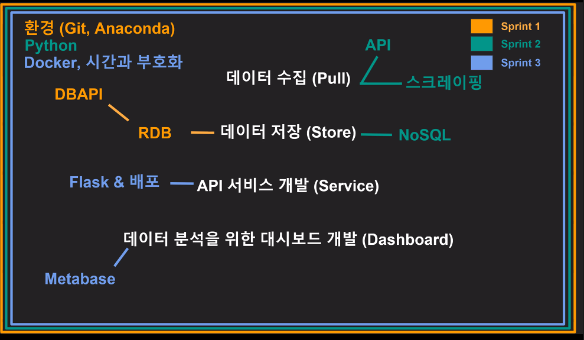

데이터 직군에서 사용하는 기초 지식 배웠다. 데이터의 흐름을 배웠다고 말할 수 있다. 이걸 모든 데이터 직군이 기본으로 알고 있어야 하냐면 협업에서 기본 지식을 갖고 있어야 하고, 상황마다 투입되는 인원이 제한적일 수 있기 때문이다. 전체적인 큰그림은 아래처럼.

개발자로서는 Git을 다룰 줄 알아야 한다. 제품의 변경사항을 기록하고, 협업하여 기능을 추가할 수 있다. 데이터 직군으로서는 데이터를 다루기 위해 역시 데이터베이스를 다룰 줄 알아야 한다. 항상 `pandas`에서 `.csv` 파일을 불러올 수 없다. 데이터는 아주 방대한 양이 있을 것이고, 제한적 권한이 있을 수 있으며, 일부만 다룰 수도 있기 때문이다.

데이터베이스는 관계형 데이터베이스(Relational Database, RDB)와 그렇지 않은 데이터베이스(NoSQL)로 구분할 수 있다. RDB는 테이블의 컬럼들이 다른 테이블과 연관이 있을 때, 데이터 형식이 정해져 있을 때 주로 사용한다. 반면 NoSQL은 형식에 구애받지 않고 데이터를 저장하고 싶을 때 사용한다. RDB는 한 번 정리 된 데이터, NoSQL은 정리되지 않고 빠르게 데이터를 수집할 때 주로 사용한다.

RDB의 주요 기능은 트랜젝션. 여러 작업들이 연속적으로 처리되는 단위이다. 은행 용어랑 매우 비슷한 의미를 가지는데, 송금 작업이 성공적으로 이루어지기 위해 일련의 과정들이 있을 것이고 한 쪽에서 보내고 다른 쪽에서 받는 것이 둘 다 성공적으로 이루어져야 송금이 완료되어야 하지, 한 쪽에서는 보냈는데 다른 쪽에서 받지 못 한다면 그것은 성사되어서는 안 되며 실패로 처리되어 원래 상태로 돌아가야 한다. 트랜젝션은 이것이 기본적으로 적용된다.

이 트랜젝션을 수행하고 나서 이를 확정지어 데이터베이스를 업데이트 하는 행위를 COMMIT이라고 한다. git에서 staging하고 나서 commit하는 것과 비슷하다. ROLLBACK은 트랜젝션을 취소하는 개념이다. git에서 restore --staged와 비슷하다.

트랜젝션에는 ACID가 보장된다. Atomicity: 트랜젝션을 구성하는 하나 하나(atom)가 전부 성공하거나 전부 실패해야 한다. Consistency: 데이터베이스의 상태는 트랜젝션 전과 후에 이전과 같은 유효한 상태여야 한다; 즉 스키마에 위배되는 트랜젝션은 있을 수 없다. Isolation: 하나의 트랜젝션이 다른 트랜젝션에게 보여지는 정도이다; 예를 들어 은행에서 계좌이체를 할 때 전액을 동시에 다른 두 계좌로 각각 이체한다고 했을 때 하나의 트랜젝션으로 인해 전액이 이체되었기 때문에 다른 트랜젝션에서는 이를 알고 실행되지 않아야 한다. Durability: 트랜젝션의 COMMIT은 영구적으로 기록되어야 한다; 시스템이 다운되어도 그 COMMIT 기록은 남는다.

oreily 책

http://www.yes24.com/Product/Goods/66277191